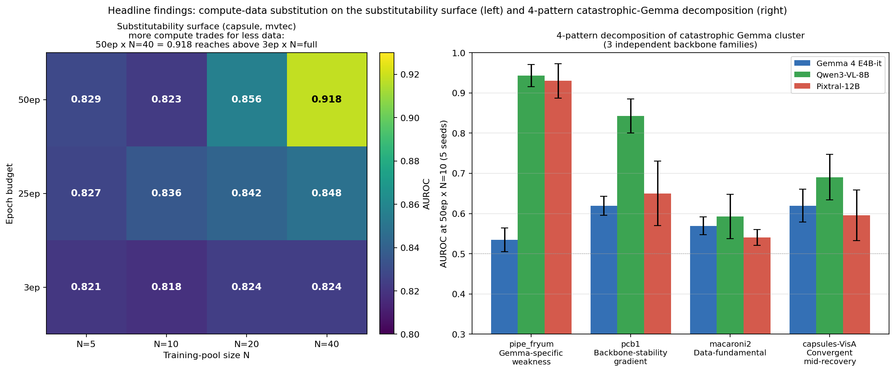
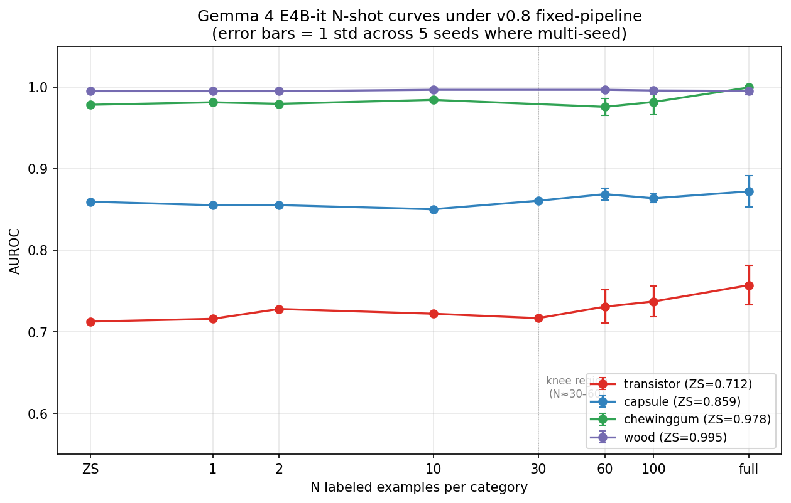
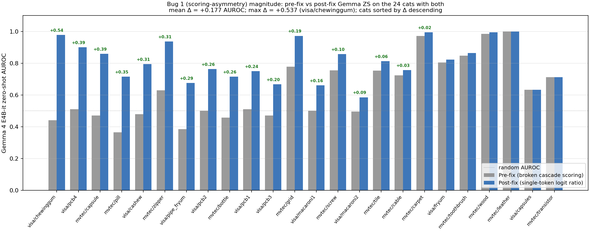
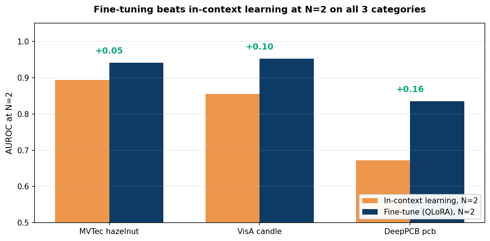

# fsvlm

**A few-shot VLM benchmarker that fits on a 16 GB laptop GPU. Train an industrial defect
detector with as few as 2 labeled images, on your own hardware, with git-SHA + recipe-version
provenance on v0.1+ result rows and a 15-skill catalog of runtime-agnostic playbooks.**

[](https://github.com/ahmadhasan2k8/fsvlm/actions/workflows/ci.yml)
[](LICENSE)
[](pyproject.toml)
[](https://github.com/unslothai/unsloth)

---

> **🛠 v0.2 audit notice (2026-05-02, updated 2026-05-27).** A pre-conclusion methodology audit found
> [**ten implementation pitfalls**](docs/audit-trail.md) in the pipeline that, individually or
> together, inflated apparent few-shot fine-tuning lift. Bugs 1–8 fixed in commit `6c8cc9e`; Bug 9
> surfaced when integrating Llama-3.2-Vision and is documented with a response-style-aware scorer
> opt-in; Pitfall #10 (checkpoint policy at long-epoch × small-N) surfaced 2026-05-26 during
> cross-recipe checking and is now controllable via the post-refactor trainer. Corrected results
> live under recipe versions `v0.7-zs-logit-only*`, `v0.8-fixed-pipeline*`, `v0.4-longepoch-validation*`,
> and `v0.5-2d-sweep-*` in `research/dataset_size_results.json`.
>
> **What changed in framing.** fsvlm is positioned as a **reproducible, audited benchmark
> for few-shot generative-VLM industrial AD** rather than a single-finding research codebase.
> Backbone-swappable (Gemma 4, Qwen3-VL, Pixtral, Llama-3.2-Vision), provenance-stamped,
> with a worked add-a-new-backbone walkthrough in
> [CONTRIBUTING.md](CONTRIBUTING.md#adding-a-new-backbone). The 10-item pitfalls checklist is
> part of the benchmark contract — every from-scratch implementer would plausibly hit them,
> and we publish the hygiene checks that catch them.

---

## Current state (2026-05-27)

**Headline characterization, all under the post-audit pipeline:**



- **3-backbone coverage.** Gemma 4 E4B-it (full 27-cat ZS + 27-cat 50ep × N=10 × 5-seed),
  Qwen3-VL-8B-Instruct (full 27-cat ZS + 7-cat ZS-and-FT + 4-cat cross-family 5-seed FT),
  Pixtral-12B-2409 (full 27-cat ZS + 4-cat cross-family 5-seed FT). All 16 GB laptop GPU.
- **144-cell 2D substitutability sweep** on 4 representative cats (capsule, transistor,
  bottle, pcb1) × 4 N values × 3 epoch budgets × 3 seeds, plus a **4-pattern decomposition**
  of the catastrophic-Gemma cluster (pipe_fryum, pcb1, macaroni2, capsules-VisA) across the
  three independent backbone families.
- **Pre-registration discipline.** Three pre-registered passes locked in 2026-05-26/27 in
  [`research/queue.json`](research/queue.json) before execution: `pass8-pitfall10-capsule-policy-control`
  (committed `8517b57`, result confirms H2 — substitutability is policy-conditional on capsule);
  `pass9-lr-sensitivity-3ep-small-N` (committed `3095d6f`, in flight); and
  `pass10-deferred-same-policy-controls` (committed `e387483`, queued).
- **10-item pitfalls checklist** — [`docs/audit-trail.md`](docs/audit-trail.md) — with per-bug
  symptom / impact / fix / hygiene check. Pitfall #10's per-(cat × epochs) magnitude table is
  the newest addition; it documents that disk-management workarounds for long training can
  flip individual-cat substitutability conclusions.

---

## What the tool actually shows (post-audit, Gemma 4 E4B-it)



*Four categories swept end-to-end at N ∈ {ZS, 1, 2, 10, 30, 60, 100, full} on a single
16 GB laptop GPU. Recipe: Gemma 4 E4B-it via QLoRA, **post-audit `v0.8-fixed-pipeline`**
(single-token PASS/FAIL logit ratio, all 8 bugs fixed). Multi-seed (5 seeds) at the
headline anchors; error bars = 1 std. **Honest picture**: chewinggum and wood are
saturated at ZS (~0.98 / ~0.995) — fine-tuning preserves but doesn't lift. Capsule sits
near a flat 0.86 across the entire N curve. Transistor shows the only measurable lift
(0.712 → 0.757 at N=full), and even that is small. **The "few-shot fine-tuning delivers
near-full lift at N=2" headline from the pre-audit v0.1 figures does not survive the
Bug 1 scoring-asymmetry correction** — see [`docs/audit-trail.md` Bug 1](docs/audit-trail.md).
Per-category variance and failure modes documented in
[docs/benchmarks.md](docs/benchmarks.md).*

---

## The bug that suppressed apparent few-shot lift (Bug 1, audit-trail)



*The single most consequential pitfall in the 10-item checklist. The pre-fix pipeline used
a cascade scorer that returned a constant (0.1) for any image whose first generated token
was `PASS` — collapsing scores on the entire good/defect distribution wherever the model
happens to emit `PASS` verbatim at zero-shot. **Across the 24 cats with both pre-fix and
post-fix ZS data on Gemma 4 E4B-it, the post-fix ZS is on average +0.18 AUROC higher than
the pre-fix value (max +0.54 on visa/chewinggum).** This single fix shifts the headline
"few-shot fine-tuning recovers most of the lift at N=2" story to "the pre-trained generative
VLM is already near-saturated on many cats; what we measured as 'lift' was scoring
asymmetry between the ZS and trained-eval paths".*

> **Honest framing of prior art.** Logit-based scoring of LLM outputs is a known
> technique, not a discovery here. [LogicQA (Jin et al., AAAI 2025)](https://arxiv.org/abs/2501.01767)
> validates that "using the token prediction probability as the reliability of the answer
> and using it as the Anomaly Score is valid" in the same domain. fsvlm's contribution is
> **not** "the literature has been measuring wrong" — it's the worked-example open-source
> fix + the documented per-cat effect size on a public benchmark, useful to practitioners
> who built the naive first-token pipeline and didn't know there was a better default.
> AnomalyGPT, Anomaly-OV, and the other most-cited papers in this space use separate image
> decoders or different metrics entirely; the critique applies to a specific subset of
> pipelines, not to "the literature."

The full 10-item pitfalls checklist with per-bug symptom / impact / fix / hygiene check is
in [`docs/audit-trail.md`](docs/audit-trail.md). Pitfall #10 (checkpoint policy at long-epoch
× small-N) was added 2026-05-27 with per-(cat × epochs) magnitude data showing the policy
can flip individual-cat substitutability conclusions.

---

## Fine-tune vs in-context learning at extreme few-shot



Same Gemma 4, same fixed test split, same prompts. At N = 2, fine-tuning wins on all three
categories. At N = 8 (not shown), in-context learning catches up and overtakes fine-tuning on
hazelnut — the picture is richer than "fine-tune always wins". Honest framing: **FT wins at
extreme-few-shot (N ≤ 2); ICL catches up by N ≈ 8 on categories where the base VLM is already
near ceiling.** See [docs/research-log.md](docs/research-log.md) for the deeper analysis.

---

## A predictive rule, twice held-out, tested across 3 model families

After running the per-category curves above on Gemma 4, we asked the next question: **when
does few-shot fine-tuning of a generative VLM help on industrial-anomaly detection, and when
doesn't it?** A pre-registered defect-taxonomy hypothesis was falsified at the first stage
(distinctive vs subtle defect families did *not* predict lift). A post-hoc rule emerged from
the data and was then locked into git history *before* further testing:

> **Few-shot fine-tuning lift correlates inversely with zero-shot AUROC.** Categories where the
> base VLM is already strong gain little from N=2 fine-tuning; categories where the base VLM
> is at chance gain the most. N=2 captures ≥80% of the maximum lift wherever lift exists.

We tested this rule on three model families at the same recipe (rank=8, lr=2e-4, epochs=3):

| Model family | n cats | Spearman ρ (ZS vs lift) | p-value | Verdict |
|---|---:|---:|---:|:---:|
| Gemma 4 E4B-it (Google) | 24 | **−0.778** | < 10⁻⁵ | ✅ rule transfers |
| Qwen3-VL-8B-Instruct (Alibaba) | 5 | **−1.000** | < 10⁻⁴ | ✅ rule transfers |
| Llama-3.2-11B-Vision (Meta) | 5 lowest-ZS | **+0.200** | 0.63 | ❌ does not transfer under this recipe |

**The Llama outcome is itself a finding.** On Llama's five lowest-ZS categories (best possible
test of the rule's lift prediction), all lifts collapsed to [-0.005, +0.070] AUROC — 10× smaller
than Qwen3's [+0.197, +0.443] on similar-ZS categories. The adapter trains, parameters update,
but inference behavior doesn't change. Five testable root-cause hypotheses are documented in
[docs/research-log.md](docs/research-log.md); recipe was held constant by design (the recipe-stability
sub-study showed the rule survives rank ∈ {8, 16, 32} and lr ∈ {1e-4, 2e-4} variation on Gemma,
so per-model recipe tuning would have made cross-model comparison meaningless).

The rule transfers to two of three model families tested. The third reveals a model-architecture
boundary that warrants follow-up. Both the positive transfer and the boundary-finding are real
empirical results, reported as-is per the no-goalpost-moving discipline of the loop.

The pre-registered structure is auditable in git history:

- Pre-registration commit: `2234019` (taxonomy frozen 2026-04-20T12:30Z, before pass4 cells ran)
- Stage1 falsification + stage2 prediction lock: `e7d7856`
- Stage2 partial-pass + stage3 prediction lock: `93a9fa6`
- Stage3 final pass on Gemma: `13f0a62`
- Multi-model close-out (this finding): `fbb2f96`

Each stage's predictions were committed before any cell of the next stage ran. Three published
expert-review JSONs (`research/expert_reviews/training-specialist_*.json`) document the
loop's decision points at each transition. The strategy-flavored counterparts live under
`_local/paper_workspace/` (gitignored) so the public artifacts contain only data-and-decision
reasoning.

---

## Why a researcher might care

| | Classical (Anomalib) | Frozen-CLIP (WinCLIP+, PromptAD) | Generative-VLM (AnomalyGPT, Anomaly-OV, Triad) | **fsvlm** |
|---|:---:|:---:|:---:|:---:|
| Per-category N-shot AUROC published | not the focus | aggregated, paper-only | aggregated, paper-only | **per-cell, append-only log** |
| Single consumer GPU | ✅ | ✅ | ❌ (cluster) | **✅ 16 GB laptop** |
| Open code, Apache 2.0 | ✅ | partial | partial | **✅** |
| Score-extractor disclosed as methodology axis | n/a | n/a | ❌ | **✅ v0.1 cascade** |
| Pre-registered taxonomy with frozen timestamp | ❌ | ❌ | ❌ | **✅** |
| Append-only result log (git SHA + recipe version per row) | ❌ | ❌ | ❌ | **✅ for v0.1+ rows** |
| Autoresearch loop pattern + reference drivers | n/a | n/a | n/a | **✅ docs + bash drivers** |
| Skill catalog with declarative eval JSONs (Anthropic schema) | n/a | n/a | n/a | **✅ 15 skills + reference harness** |

This table compares fsvlm's *measurement infrastructure*, not head-to-head AUROC. Numbers from
WinCLIP+ / PromptAD / AnomalyGPT / Triad come from their published papers and are **not yet
rerun on our splits**. Direct head-to-head AUROC comparison on identical splits is on the v0.2
roadmap (Anomalib PatchCore first). Several "✅" rows above describe dimensions the cited
projects weren't designed for — they're noted to be transparent about what fsvlm adds, not to
imply the others are deficient at their own goals.

---

## Why a practitioner might care

You have a folder of images. Half are good parts, half have defects. You want a detector. fsvlm
gives you, in three commands, on your own GPU, in under an hour:

- A trained adapter (~80 MB) that runs on the same 16 GB laptop GPU
- A validation report (HTML + JSON) showing AUROC, F1, confusion matrix, and a failure gallery
- An inference surface — single image, batch folder, drop-folder watch mode, FastAPI REST,
  Gradio UI — all sharing the same adapter and producing the same JSON

No cloud round-trip, no per-month subscription, no telemetry by default.

---

## Install and try in 30 seconds

Three ways to use this — pick whichever matches your tooling.

### Option 1 — Direct CLI (no agent runtime)

```bash
pip install git+https://github.com/ahmadhasan2k8/fsvlm
fsvlm setup --check                                       # detect GPU, verify deps
python examples/quickstart/make_dataset.py                # 20 synthetic images
python examples/quickstart/check_pipeline.py              # 4 PASS checks, no GPU needed
```

If those four checks pass, your install is healthy. Move on to real training:

```bash
fsvlm setup                                                # download Gemma 4 E4B-it (4-bit)
fsvlm train --images ./my-data/                            # good/ + defect/ subdirs
fsvlm inspect new-image.jpg --adapter ~/.fsvlm/adapters/latest/
fsvlm ui                                                   # SAM-assisted Gradio annotation + training
```

### Option 2 — Claude Code (recommended if you have it — auto-loads everything)

```bash
git clone https://github.com/ahmadhasan2k8/fsvlm
cd fsvlm
pip install -e .
claude
```

That's the whole setup. Claude Code reads the public [`.claude/`](.claude/) directory and:

- **Auto-discovers all 15 skills** as slash-commands. Type `/setup`, `/train`, `/sweep`,
  `/verdict`, `/plot`, `/autoresearch` — Claude reads the procedure markdown and runs the
  underlying CLI for you, asking only when it hits a real decision point.
- **Loads the safety hook** at [`.claude/hooks/block-dangerous.sh`](.claude/hooks/block-dangerous.sh)
  so every shell command Claude issues is screened first — refuses recursive force-deletes,
  force-push, hard reset, deletion of training images, dropping database tables, sudo, and
  ~12 other foot-gun patterns. Saves you from yourself.
- **Knows about the 2 expert sub-agents** at [`.claude/agents/`](.claude/agents/) (a VLM
  fine-tuning specialist and a defect-detection specialist) so `/expert-review` works out
  of the box. Both are also useful templates for forking into your own
  domain-specialist sub-agents (security, perf, accessibility, API contract, etc.).

See [`.claude/README.md`](.claude/README.md) for the full layout and what's deliberately
private.

### Option 3 — Other agent runtimes (Cursor, OpenAI Agents SDK, CrewAI, your own)

The 15 skills are runtime-agnostic Markdown playbooks with structured YAML frontmatter
declaring `inputs`, `eval_artifact`, `pass_criteria`, and `escalation`. Two paths:

- **For procedural skills** (`setup`, `train`, `inspect`, `validate`, `serve`, `sweep`,
  `verdict`, `tiered-eval`, `plot`, `meta-eval` — the 10 that wrap a single CLI command):
  invoke directly via `bash skills/_run.sh <name> [args]`. Works from cron, Make, CI,
  whatever. No agent needed.
- **For orchestrator skills** (`autoresearch`, `improve-skill`, `improve-skills-auto`,
  `expert-review`, `debug` — the 5 that compose other skills with conditional logic):
  register the skill markdown as a tool in your agent runtime; the runtime reads the
  procedure body, dispatches sub-skills via `_run.sh`, and handles the stop/pause/ask
  decision points.

The `skills/evals/<name>.eval.json` files follow the
[Anthropic skill-creator eval schema](https://github.com/anthropics/skills) — your runtime
can use them to grade trigger/output quality.

---

## Architecture

```
┌─────────────────────────────────────────────────────────────────┐
│  Interface layer    CLI · Gradio UI · FastAPI · watch-mode      │
├─────────────────────────────────────────────────────────────────┤
│  Agent layer                                                    │
│    Orchestrator · DataAgent · TrainingAgent · ValidationAgent   │
│    InspectorAgent · FeedbackAgent · AnnotationAgent · SAM       │
├─────────────────────────────────────────────────────────────────┤
│  Domain layer       pure Python — types, schemas, ABCs, config  │
└─────────────────────────────────────────────────────────────────┘
```

Three layers, dependencies inward only. The Domain layer can be imported in <1 s with no GPU
dependencies pulled in (CI verifies `import fsvlm` is torch-free). Heavy imports happen inside
the agents that need them.

Five extension points use abstract base classes registered through a decorator. Adding a new
implementation is **one new file**; no existing file changes.

| ABC | What it lets you add | v0.1 ships with |
|-----|----------------------|-----------------|
| `ModelBackend`    | A new VLM family — Qwen-VL, LLaVA, Phi-Vision, InternVL, MiniCPM-V, future Gemmas | Gemma 4 E4B-it (4-bit via unsloth) |
| `LabelReader`     | A new dataset / label format | folder, CSV, JSON, VisA `1cls.csv`, DeepPCB |
| `ScoreExtractor`  | A new way to turn VLM output into an anomaly score | v0.1 token-logit cascade + legacy keyword-match |
| `TrainingBackend` | A different fine-tuning library | unsloth (default and recommended) |
| `ReportGenerator` | A new validation-report output format | HTML (Jinja2), JSON |

One-PR recipes for each are in [docs/autoresearch.md § 6](docs/autoresearch.md).

---

## The skill catalog — 15 playbooks for the "0 → paper" path

Every routine workflow ships as a [Markdown playbook with YAML frontmatter](skills/README.md)
declaring `name`, `description`, `inputs`, `eval_artifact`, `pass_criteria`, and `escalation`.
**Two kinds of skills, with a sharp difference in how they run:**

### ✅ Procedural skills (10) — directly runnable from shell

Wrap a single underlying CLI command or script. Invoke from cron / Make / your own shell
loop / CI — no agent runtime required:

```bash
bash skills/_run.sh setup --check
bash skills/_run.sh train --images ./my-data/ --epochs 3
bash skills/_run.sh sweep --datasets mvtec --categories hazelnut --n-values 0 30 --seeds 42
bash skills/_run.sh verdict --results research/dataset_size_results.json --write
bash skills/_run.sh plot  --results research/dataset_size_results.json --output docs/figures/
```

The 10 procedural skills: `setup`, `train`, `inspect`, `validate`, `serve`, `sweep`,
`verdict`, `tiered-eval`, `plot`, `meta-eval`. The `_run.sh` dispatcher is real, ships in
v0.1, and resolves your local Python interpreter automatically.

For the auto-loading-into-Claude-Code path see [Option 2 of the install section](#option-2--claude-code-recommended-if-you-have-it--auto-loads-everything)
above; for non-Claude-Code agent runtimes see Option 3.

### 🤝 Orchestrator skills (5) — semi-autonomous, need a runtime

Make conditional decisions ("if verdict says X, dispatch /sweep with these params; if expert
review says halt, halt"). They're **documented protocols, not autonomous runners** —
something has to interpret the procedure markdown, decide when to stop / pause / ask, and
call the procedural sub-skills via `skills/_run.sh`. Three execution paths:

1. **Claude Code** (the primary intended runtime) — drop `skills/<name>.md` into
   `~/.claude/skills/` and invoke as `/<name>`. The agent reads the procedure, makes the
   conditional calls, asks you when it hits a fork it can't resolve.
2. **Another agent runtime** (OpenAI Agents SDK, CrewAI, your own loop driver) — register
   the skill's procedure as a tool whose body executes the steps, calling
   `skills/_run.sh <sub-skill>` for each procedural sub-skill it dispatches.
3. **Manual** — read the skill markdown and step through it yourself, calling
   `skills/_run.sh` for sub-skills and making the decision-point judgment calls by hand.

Direct shell invocation (`skills/_run.sh autoresearch`) returns an explicit "needs a
runtime" error pointing at the three options above.

The 5 orchestrator skills: `autoresearch`, `improve-skill`, `improve-skills-auto`,
`expert-review`, `debug`.

### Eval JSONs + meta-loop

Each skill ships with a sibling [`skills/evals/<name>.eval.json`](skills/evals/) declaring
(prompt, expected trigger, assertions) following the
[Anthropic skill-creator eval schema](https://github.com/anthropics/skills). The portable
eval harness at `scripts/run_skill_eval.py` grades skills against the Anthropic Messages
API (needs `ANTHROPIC_API_KEY`).

> **Honest scope of v0.1.** The procedural skills + `_run.sh` are turnkey. The orchestrator
> skills are documented protocols + eval JSONs that need a runtime. The skill-self-improvement
> meta-loop (`/improve-skill`, `/improve-skills-auto`) is documented end-to-end but has no
> committed evidence of having actually self-improved a shipped skill — treat it as a
> protocol, not a live capability. The harness's `claude-code` and `openai-sdk` runtime
> adapters are stubs that describe the wiring but need per-stack implementation. PRs that
> turn any of these into turnkey runners are welcome.

> The two distinctive contributions on top of [Karpathy's autoresearch loop](https://fortune.com/2026/03/17/andrej-karpathy-loop-autonomous-ai-agents-future/)
> are **expert-agent consultation as a separate step from the verdict classifier**
> (anti-Goodhart guard) and **skills with declarative PASS/FAIL self-eval YAML frontmatter**
> (the contract that lets the loop iterate without a human in every loop body). See
> [docs/autoresearch.md § 4.5](docs/autoresearch.md) for the full "his vs ours" boundary.

---

## Reproducing every number on this page

**Fastest path — verify the headline numbers from the committed result rows in 1 second:**

```bash
python scripts/verify_readme_numbers.py
```

This re-derives every headline percentage and AUROC value from
`research/dataset_size_results.json` with the explicit recipe-version filter shown next to
each number. If your output diverges from the README, file an issue.

**Full reproduction — re-run the actual sweep that produced those rows (requires GPU):**

```bash
# Datasets (MVTec AD requires email registration; place under research/mvtec_data/)
bash research/datasets/download_visa.sh
bash research/datasets/download_deeppcb.sh

# AUROC-vs-N curves (Section 1 + Section 3 above)
bash research/run_sweep.sh \
  --datasets mvtec visa deeppcb \
  --categories hazelnut candle pcb \
  --n-values 0 2 3 5 10 20 30 40 60 100 \
  --seeds 42 1337 7 \
  --epochs 3

# Score-extractor audit (Section 2)
bash research/run_sweep.sh \
  --datasets mvtec visa deeppcb \
  --categories hazelnut metal_nut candle pcb \
  --n-values 0 \
  --seeds 42 \
  --extractor v0.1

# Verdict classifier marks each cell keep / discard / noop / new_baseline
python research/verdict.py --results research/dataset_size_results.json --write
```

Rows in [`research/dataset_size_results.json`](research/dataset_size_results.json) carry
`git_hash` + `recipe_version` from v0.1 onwards (89 % of the 159 logged rows; earlier
exploratory rows from before the provenance contract was finalised remain in the log without
those fields, marked by their absence). **The `status` field is populated on 100 % of rows**
(`research/verdict.py` was run against every recipe cohort; the early smoke-pass rows that
had no prior baseline to compare against are marked `new_baseline`).

---

## Honest scope — current state (2026-05-27)

- ✅ **10-item methodology pitfalls checklist published.** Bugs 1–8 fixed in commit `6c8cc9e`;
  Bug 9 (position-0 scoring) ships with a response-style-aware opt-in (`FSVLM_RESPONSE_STYLE_AWARE=1`);
  Pitfall #10 (checkpoint policy at long-epoch × small-N) documented 2026-05-27 with
  per-(cat × epochs) magnitude table. Full audit + fixes + hygiene checks in
  [`docs/audit-trail.md`](docs/audit-trail.md).
- ✅ **Three backbones characterized under the post-audit pipeline** — Gemma 4 E4B-it
  (full 27-cat ZS + 27-cat 50ep × N=10 × 5-seed sweep), Qwen3-VL-8B-Instruct (full 27-cat ZS
  + 7-cat ZS-and-FT + 4-cat cross-family 5-seed FT), Pixtral-12B-2409 (full 27-cat ZS +
  4-cat cross-family 5-seed FT on the catastrophic-Gemma cluster). Recipe versions
  `v0.7-zs-logit-only*`, `v0.8-fixed-pipeline*`, `v0.4-longepoch-validation*`. All on a 16 GB
  laptop GPU at 4-bit.
- ✅ **144-cell 2D substitutability sweep** (4 cats × 4 N × 3 epoch budgets × 3 seeds × Gemma)
  with iso-AUROC contours per cat. Surfaces compute–data trade as a 2D shape, not a point.
  Lives under recipe versions `v0.5-2d-sweep-{3,25,50}ep`.
- ✅ **4-pattern decomposition of the catastrophic-Gemma cluster** on 4 cats × 3 backbones
  (Gemma + Qwen3 + Pixtral). Gemma-specific weakness, backbone-stability gradient,
  data-fundamental, convergent mid-recovery — descriptive labels, post-hoc, no independent
  replication (an exploratory categorization on n=4 cats, not a tested theory).
- ✅ **Pre-registration discipline in place.** Hypotheses + binding decision rules committed
  to [`research/queue.json`](research/queue.json) before execution: `pass8-pitfall10-capsule-policy-control`
  (committed `8517b57` 2026-05-26, run 2026-05-27, **H2 confirmed** — substitutability on capsule
  is policy-conditional); `pass9-lr-sensitivity-3ep-small-N` (committed `3095d6f` 2026-05-27,
  in flight); `pass10-deferred-same-policy-controls` (committed `e387483` 2026-05-27, queued
  behind pass9).
- ✅ **WinCLIP+ K=2 specialist baseline integrated** with matched test splits (Bug 5 fix
  applied). Lives in `research/baselines/run_winclip.py`.
- ✅ **Backbone-swappable architecture.** `FSVLM_DEFAULT_MODEL` env var binds via Pydantic
  `BaseSettings`; both training and zero-shot eval honour it. Worked walkthrough in
  [CONTRIBUTING.md § Adding a new backbone](CONTRIBUTING.md#adding-a-new-backbone).
- ⚠️ **Pre-audit results superseded.** Older v0.1-cascade numbers in git history should be
  read with [`docs/audit-trail.md`](docs/audit-trail.md) alongside; any pre-fix recipe
  (`v0.3-tier-a`, `v0.5-tier-a-qwen3`, `v0.6-*`) is affected by Bugs 1–8 and is retained for
  transparency only.
- ⚠️ **Llama-3.2-Vision** — post-fix ZS data exists across 6 cats; Llama is included as a
  boundary-case backbone (Bug 9 was caught precisely because the audit framework demands
  new-backbone integration). All 6 N=full cells OOM at 14.3 GiB on the 16 GiB laptop GPU
  under our LoRA recipe — a documented hardware-recipe constraint, not a bug.
- ⚠️ **Substitutability claim policy-conditional on capsule.** Pre-registered pass8 control
  (run 2026-05-27, result 0.882 ± 0.017) confirmed H2: capsule's 50ep×N=10 ≈ 3ep×N=full
  substitutability holds under best-eval-loss policy but falsifies under last-epoch policy.
  Same-policy controls for the other 3 paired cats (bottle, transistor, capsules-VisA) are
  queued as pass10.
- ❌ **Pixel-level localization** out of scope. Image-level PASS/FAIL only.
- ❌ **Edge deployment** (ONNX export, INT8 quantization) — abstractions in place; exporters
  remain future work.
- ❌ **Multi-GPU / cluster training** — out of scope; this is a single-consumer-GPU framework.

---

## Documentation

- [docs/audit-trail.md](docs/audit-trail.md) — **the 10-pitfall methodology audit + fixes**
- [POSITIONING.md](POSITIONING.md) — what this is and is not, scoping decisions, decision date
- [skills/README.md](skills/README.md) — the 15-skill catalog index
- [docs/skills.md](docs/skills.md) — narrative overview of how skills work
- [docs/autoresearch.md](docs/autoresearch.md) — the loop pattern, ranked contributions, worked example
- [docs/benchmarks.md](docs/benchmarks.md) — methodology, coverage, failure modes
- [docs/research-log.md](docs/research-log.md) — decisions, findings, and failures along the way
- [CONTRIBUTING.md § Adding a new backbone](CONTRIBUTING.md#adding-a-new-backbone) — worked walkthrough
- [CONTRIBUTING.md](CONTRIBUTING.md) — how to contribute
- [SECURITY.md](SECURITY.md) — how to report vulnerabilities
- [CODE_OF_CONDUCT.md](CODE_OF_CONDUCT.md) — community standards

---

## Acknowledgements

- **[unsloth](https://github.com/unslothai/unsloth)** — the QLoRA training kernel. The
  training-speed and VRAM wins of the pipeline are theirs, not ours.
- **[Andrej Karpathy](https://github.com/karpathy)** — the autoresearch loop pattern (March
  2026 release) that this project's loop wraps with benchmark-driven discipline. Also the 2019
  *Recipe for Training Neural Networks* discipline this project tries to honour.
- **[Anthropic skill-creator](https://github.com/anthropics/skills)** — the eval-driven
  self-improvement pattern this project's skill catalog adopts.
- **[Segment Anything 2](https://github.com/facebookresearch/sam2)** — interactive mask annotation.
- **[MVTec AD](https://www.mvtec.com/company/research/datasets/mvtec-ad)**,
  **[VisA](https://github.com/amazon-science/spot-diff)**,
  **[DeepPCB](https://github.com/tangsanli5201/DeepPCB)** — the benchmark datasets.

---

## License

[**Apache License 2.0**](LICENSE). Fully open-source, commercial use allowed.

## Citation

**If you use fsvlm in published research, please cite us.** Community norm, not a legal
requirement of Apache 2.0:

```bibtex
@software{hasan_fsvlm_2026,
  author  = {Hasan, Ahmad Jarjis},
  title   = {fsvlm: Few-shot Fine-tuning Benchmarker for Vision-Language Models},
  year    = {2026},
  url     = {https://github.com/ahmadhasan2k8/fsvlm},
  license = {Apache-2.0}
}
```

See also [`CITATION.cff`](CITATION.cff) for GitHub's auto-citation widget.
